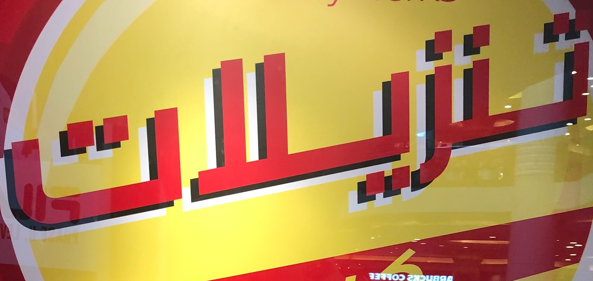
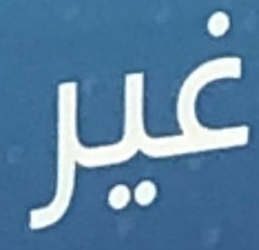
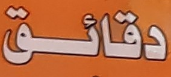
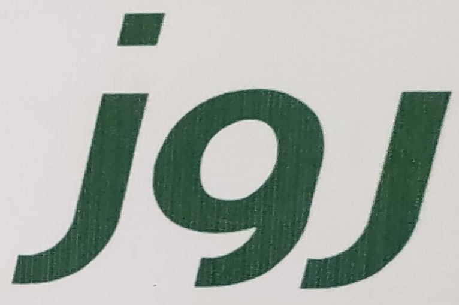
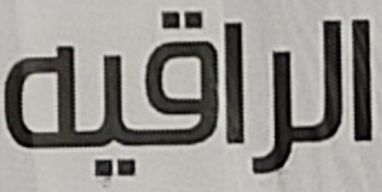
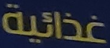

# What Is Wrong With Scene Text Recognition Model Comparisons? Dataset and Model Analysis
| [paper](https://arxiv.org/abs/1904.01906) | [training and testing data](https://github.com/HGamal11/EvArEST-dataset-for-Arabic-scene-text) | [pretrained model](https://www.dropbox.com/sh/j3xmli4di1zuv3s/AAArdcPgz7UFxIHUuKNOeKv_a?dl=0)

Official PyTorch implementation of four-stage STR framework, that most existing STR models fit into. <br>
Using this framework allows for the module-wise contributions to performance in terms of accuracy, speed, and memory demand, under one consistent set of training and evaluation datasets. <br>


## Getting Started
### Dependency
- This work was tested with PyTorch 1.3.1, CUDA 10.1, python 3.6 and Ubuntu 16.04. <br> You may need `pip3 install torch==1.3.1`. <br>
In the paper, expriments were performed with **PyTorch 0.4.1, CUDA 9.0**.
- requirements : lmdb, pillow, torchvision, nltk, natsort
```
pip3 install lmdb pillow torchvision nltk natsort
```
or it can be performed by the environment.yml file that is provided.
```
conda env create -f environment.yml
```

### Run demo with pretrained model
1. Download pretrained model from [here](https://drive.google.com/file/d/1CRRLXQuLrMbsOiAvWC-ktcz156M4YrC1/view?usp=sharing)
2. Move the pretrained to saved_models folder
3. Add image files to test into `demo_image/`
4. Run demo.ipynb

#### prediction results

| ---         |     ---      |          --- |
|     |   available   |  Available   |
|       |    shakeshack    |   SHARESHACK    |
|   |   london   |  Londen   |
|       |    greenstead    |   Greenstead    |
|     |   toast   |  TOAST   |
|       |    merry    |   MERRY    |
|     |   underground   |   underground  |


### Training and evaluation
### Download EvAREst dataset for traininig and testing from [here](https://github.com/HGamal11/EvArEST-dataset-for-Arabic-scene-text)
1. Train CRNN[10] model
```
CUDA_VISIBLE_DEVICES=0 python3 train.py \
--train_data dataset/train_ar --valid_data dataset/test_ar \
--Transformation TPS --FeatureExtraction ResNet --SequenceModeling BiLSTM --Prediction Attn
```
2. Test CRNN model. 
```
CUDA_VISIBLE_DEVICES=0 python3 test.py \
--eval_data dataset/test_ar --benchmark_all_eval \
--Transformation TPS --FeatureExtraction ResNet --SequenceModeling BiLSTM --Prediction Attn \
--saved_model saved_models/TPS-ResNet-BiLSTM-Attn-Seed1111/best_accuracy.pth
```

### Arguments
* `--train_data`: folder path to training dataset (dataset/train_ar).
* `--valid_data`: folder path to validation dataset (dataset/test_ar) 
* `--eval_data`: folder path to evaluation (dataset/test_ar).
* `--select_data`: select training data. default is /, which means all training data.
* `--batch_ratio`: assign ratio for each selected data in the batch. default is 1, which means 100% of the batch is filled.
* `--Transformation`: select Transformation module [None | TPS].
* `--FeatureExtraction`: select FeatureExtraction module [VGG | RCNN | ResNet].
* `--SequenceModeling`: select SequenceModeling module [None | BiLSTM].
* `--Prediction`: select Prediction module [CTC | Attn].
* `--saved_model`: assign saved model to evaluation.

## Acknowledgements
This implementation has been based on these repository [WWSTR](https://github.com/clovaai/deep-text-recognition-benchmark)
